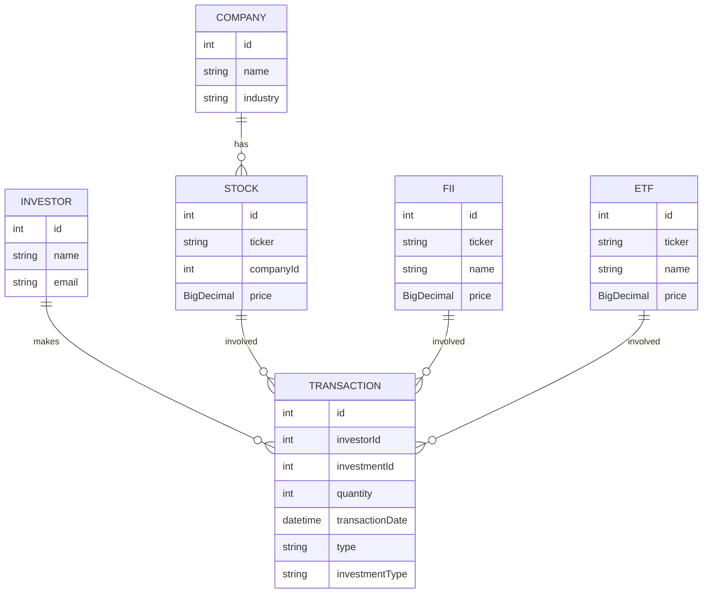

# ProjetoFullStack

## Diagrama do Modelo de Projeto

```mermaid
erDiagram
    COMPANY {
        int id
        string name
        string industry
    }

    STOCK {
        int id
        string ticker
        int companyId
        BigDecimal price
    }

    FII {
        int id
        string ticker
        string name
        BigDecimal price
    }

    ETF {
        int id
        string ticker
        string name
        BigDecimal price
    }

    INVESTOR {
        int id
        string name
        string email
    }

    TRANSACTION {
        int id
        int investorId
        int investmentId
        int quantity
        datetime transactionDate
        string type
        string investmentType
    }

    COMPANY ||--o{ STOCK : has
    INVESTOR ||--o{ TRANSACTION : makes
    STOCK ||--o{ TRANSACTION : involved
    FII ||--o{ TRANSACTION : involved
    ETF ||--o{ TRANSACTION : involved
```
